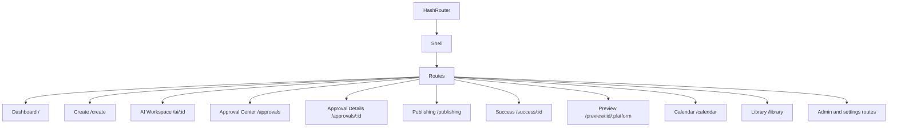
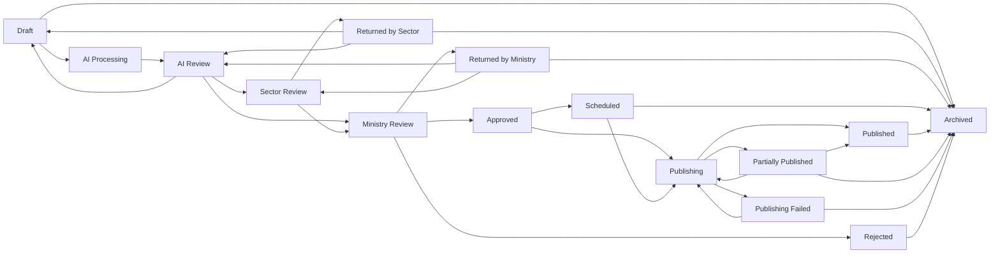

# SYSTEM IMPLEMENTATION GUIDE

Current codebase documented on 2026-07-22.

This guide describes only the implementation that exists in the project today. It does not describe planned features or recommended future work except in the final limitations/production-readiness sections.

## 1. Project Overview

Project name: `govpublish-ai`

Purpose: A browser-based prototype for preparing, reviewing, approving, scheduling, and simulating publication of multilingual government content.

Main objective: Demonstrate a Ministry of Interior content workflow where sector users create publications, AI output is simulated, ministry approval is simulated, selected languages/platforms are reviewed, and publishing results are generated in the UI.

Current implementation level: Front-end prototype with in-browser persistence. It has implemented screens, data models, workflow rules, seeded demo records, localStorage state, and automated tests for workflow/data behavior. It does not include a backend, real authentication, real AI, real translation, real publishing APIs, or server-side persistence.

Technologies used:

- React 19
- TypeScript
- Vite
- React Router DOM with hash routing
- Recharts
- Lucide React icons
- Vitest
- CSS in `src/styles.css`
- Browser `localStorage`

Architecture overview:

- `src/main.tsx` contains the React application, type definitions, seeded data, pages, shared UI components, routing, localStorage state hooks, notification creation, audit logging, publishing simulation, AI simulation, and demo data normalization.
- `src/workflow.ts` contains pure workflow/data helper functions used by the UI and tests.
- `src/workflow.test.ts` tests publication workflow rules, item-level language/platform review, role visibility, template/duplicate behavior, calendar behavior, navigation, sector content checks, and overflow helper behavior.
- `src/styles.css` defines global layout, dashboard/table/card/modal/calendar/notification styling, and responsive breakpoints.

## 2. System Architecture

### Frontend Architecture

The app is a single React entrypoint rendered from `src/main.tsx`. It uses functional React components for pages and shared UI primitives. Most page components live in the same file rather than in a folder-per-page structure.

Main shell structure:

- `App` owns application state.
- `Shell` renders the sidebar, topbar, language toggle, presentation mode toggle, notification popover, logout button, and route content.
- `Routes` maps hash routes to page components.
- Shared UI helpers such as `Page`, `Panel`, `Modal`, `Metric`, `Timeline`, `Badge`, `PublicationTable`, `Chart`, `Stepper`, `SelectableGrid`, `Tabs`, `Quality`, `SensitivePanel`, `ActionBar`, `ReviewChip`, `Comments`, and `Filters` are defined near the end of `src/main.tsx`.

### State Management

State is local React state plus `localStorage`. There is no Redux, Zustand, server cache, or backend API.

The reusable hook is:

- `useLocalState<T>(key, initial, normalize?)`

It initializes state from `localStorage`, optionally normalizes parsed data, falls back to the provided initial value on failure, and writes every state update back to `localStorage`.

Top-level state in `App`:

- `govpublish-lang`
- `govpublish-user`
- `govpublish-publications`
- `govpublish-presentation-mode`
- `govpublish-audit-logs`
- `govpublish-channels`
- `govpublish-disabled-languages`
- `govpublish-notifications`

Additional page-local storage keys are used by admin/settings pages.

### Routing

Routing uses `HashRouter` from React Router DOM. URLs are hash-based, for example `#/approvals/pub-1`.

Main routes are declared in `App`:



### Storage

All persistent app data is stored in browser `localStorage`. Export actions also write JSON payloads into `localStorage` under export-specific keys. There is no database, API server, file upload service, or remote persistence.

Publication data is normalized when loaded through `normalizePublications`, which calls `normalizePublication`. Normalization rebuilds selected language/platform arrays, translations, platform versions, publishing results, statuses, comments, history arrays, and seed-sector consistency.

### Workflow Engine

Workflow rules live in `src/workflow.ts`.

Implemented workflow helpers:

- `allowedTransitions`
- `canTransition`
- `calculatePublicationStatus`
- `hasReachedMinistry`
- `isPublicationVisibleToRole`
- `disableTranslation`
- `disablePlatform`
- `createTemplateDraft`
- `duplicatePublication`
- `archivePublication`
- `restorePublication`
- `reschedulePublication`
- `resolveNotificationTarget`
- `navPathsForRole`
- `aggregatePublishing`
- `canPublishChannel`
- `isLanguageSelectable`

### Notification System

Notifications are local objects stored in `govpublish-notifications`. The app creates notifications from workflow actions such as AI submission, ministry approval, return, platform/language return, and calendar rescheduling.

Notifications persist an optional `recipientId` and the shell/notifications page filters the shared local list to the signed-in user. Seeded workflow notifications are assigned to the appropriate approver/admin demo users. This is still client-side filtering, not server-delivered notifications.

### Audit System

Audit entries are local objects stored in `govpublish-audit-logs`. `recordAction` creates entries with user, role, sector, action, entity, reference, previous value, new value/note, mock IP, mock device, result, and date.

The Audit page displays stored audit logs if any exist. If no stored logs exist, it generates mock rows from publication data.

### Version History

Each publication has a `versionHistory` string array. Workflow actions append human-readable strings with timestamps and action descriptions. Version history is visible from Content Library through the Versions modal.

### Publishing Simulation

Publishing is simulated in the browser.

- `PublishingCenter` shows publications with `Scheduled`, `Publishing`, `Published`, `Partially Published`, or `Publishing Failed` status.
- For the demo publication reference `GP-2026-000184`, a timer animates per-channel progress.
- When all simulated channels reach 100%, the publication becomes `Published`.
- Results are written to `publishingResults`.
- Retry logic converts failed channel results to published and recalculates status with `aggregatePublishing`.

### AI Simulation

AI behavior is simulated in Create and AI Workspace pages.

- Create workflow shows progress stages.
- AI Workspace compares original and improved Arabic text.
- It shows generated translations and platform versions.
- Actions such as accept, make more formal, make shorter, and re-run translation mutate local publication fields and append version/timeline records.
- No external AI service is called.

### Translation Simulation

Translations are generated from `languageContent(language, sectorName)`, producing placeholder English text that identifies the target language and sector. Translation state is stored per selected language in both `translations` and `languageStatuses`.

## 3. Folder Structure

Important project root files and folders:

- `index.html`: Vite HTML entry.
- `package.json`: npm scripts and dependencies.
- `package-lock.json`: locked dependency tree.
- `tsconfig.json`: TypeScript project settings.
- `tsconfig.node.json`: TypeScript config for Vite/node tooling.
- `postcss.config.js`: PostCSS configuration.
- `tailwind.config.js`: Tailwind config exists, though the current app styling is primarily plain CSS in `src/styles.css`.
- `start-dev.ps1`: PowerShell helper for starting the Vite dev server.
- `start-preview.ps1`: PowerShell helper for Vite preview.
- `README.md`, `IMPLEMENTATION_REPORT.md`, `FUNCTIONAL_QA_REPORT.md`, `USER_ACCEPTANCE_TESTS.md`: existing project documentation/report files.
- `dist/`: generated Vite production build output.
- `node_modules/`: installed dependencies.
- `outputs/`: copies of existing markdown output artifacts.
- `work/`: local logs and npm cache artifacts.
- `.agents/`, `.codex/`, `.git/`: project metadata.

Important `src/` files:

- `src/main.tsx`: Main React app, models, seed data, routes, pages, localStorage state, normalizers, UI primitives, and render call.
- `src/workflow.ts`: Pure workflow, permission, publication-state, template, archive, calendar, publishing, navigation, and utility functions.
- `src/workflow.test.ts`: Vitest unit tests for workflow helpers and data rules.
- `src/styles.css`: Global CSS, layout, cards, tables, modals, calendar, notifications, presentation mode, and responsive breakpoints.

There are no implemented `components/`, `pages/`, `services/`, `types.ts`, or `utils/` folders. Those responsibilities are currently concentrated in `src/main.tsx` and `src/workflow.ts`.

## 4. User Roles

Implemented roles are defined by `RoleId`:

- `creator`
- `reviewer`
- `approver`
- `admin`
- `auditor`

Demo users:

- Abdullah Alawad: creator, Prisons, `creator@prisons.gov.sa`
- Sarah Alotaibi: creator, Civil Defense, `creator@civildefense.gov.sa`
- Khalid Alharbi: reviewer, Civil Defense, `reviewer@civildefense.gov.sa`
- Noura Alqahtani: ministry approver, `approver@moi.gov.sa`
- Majed Alsubaie: admin, `admin@moi.gov.sa`
- Reem Alshehri: auditor, `auditor@moi.gov.sa`
- Fahad Albalawi: creator, Border Guard, `creator@borderguard.gov.sa`
- Mona Alghamdi: creator, Passports, `creator@passports.gov.sa`

### Creator

Purpose: Create and manage sector publications.

Accessible pages through sidebar:

- Dashboard
- My Sector Publications
- Templates
- Calendar
- Notifications

Permissions:

- View publications in own sector.
- Create publication through `/create`.
- Save draft.
- Run simulated AI.
- Submit to ministry from AI Workspace when transition rules allow.
- Use templates if the account has a sector.
- Duplicate/follow up from library only if routed there and role/sector allow creation.

Hidden pages in sidebar:

- Approval Center
- Publishing Center
- Content Library
- Analytics
- Audit Logs
- Admin pages

Restricted actions:

- Cannot approve ministry publications.
- Cannot publish.
- Cannot manage users, sectors, languages, channels, terms, workflows, AI settings, or system health.

### Reviewer

Purpose: Review sector content within the same sector.

Accessible pages through sidebar:

- Dashboard
- My Sector Publications
- Approval Center
- Calendar
- Notifications

Permissions:

- View same-sector publications.
- Open approval detail pages for visible items.
- Use some creator-like content actions where implemented by role checks.

Hidden pages in sidebar:

- Publishing Center
- Content Library
- Analytics
- Audit Logs
- Admin pages

Restricted actions:

- Cannot approve ministry-level decisions because `canTransition` requires `approver` for `Approved`.
- Cannot publish because `canTransition` requires `approver` or `admin` for `Publishing`.

### Ministry Approver

Purpose: Review publications that have reached ministry-level review.

Accessible pages through sidebar:

- Dashboard
- Approval Center
- Publishing Center
- Calendar
- Notifications

Permissions:

- View publications that have reached ministry stages.
- Approve from `Ministry Review`.
- Return or reject from `Ministry Review` with required reasons.
- Return individual languages.
- Exclude individual platforms.
- Start publishing from `Approved`.
- View publishing progress/results.

Hidden pages in sidebar:

- My Sector Publications
- Templates
- Content Library
- Analytics
- Audit Logs
- Admin pages

Restricted actions:

- Does not see drafts, AI-only records, or sector-review-only records through `isPublicationVisibleToRole`.
- Cannot manage administrative settings.

### Administrator

Purpose: Manage prototype configuration screens.

Accessible pages through sidebar:

- Dashboard
- Users
- Sectors
- Languages
- Channels
- Workflow Settings
- Templates
- Terminology
- AI Settings
- Audit Logs
- System Health
- Reset Demo Data

Permissions:

- Toggle users active/inactive.
- Add a demo user.
- Toggle sectors active/inactive and append account-review marker text.
- Enable/disable languages with reasons.
- Enable/disable channels.
- Test channel connections.
- Edit workflow strings.
- Edit AI setting values.
- Add terminology entries.
- View audit logs.
- Test simulated service health.
- Reset demo data.
- View all templates.

Hidden pages in sidebar:

- My Sector Publications
- Approval Center
- Publishing Center
- Calendar
- Content Library
- Analytics

Restricted actions:

- Although workflow helper allows admin to start `Publishing`, the current admin sidebar does not expose approval or publishing pages.

### Auditor

Purpose: Read-only review of library, audit, and analytics.

Accessible pages through sidebar:

- Dashboard
- Content Library
- Audit Logs
- Analytics

Permissions:

- View all publications because `isPublicationVisibleToRole` returns true for auditor.
- View audit logs.
- View analytics.
- Export analytics records.
- In Content Library, auditors get read-only View, Preview, and Versions actions only.

Hidden pages in sidebar:

- My Sector Publications
- Approval Center
- Publishing Center
- Calendar
- Templates
- Admin pages

Restricted actions:

- `canTransition` blocks workflow transitions for auditors.
- Approval details shows read-only auditor access in the decision section when reached.

## 5. Navigation

Navigation is built by `navItems`, filtered by `navPathsForRole`.

| Page | Route | Purpose | Sidebar roles | Main actions | Data source |
|---|---|---|---|---|---|
| Dashboard | `/` | Role-specific operational summary | All roles | View metrics, charts, recent activity | `publications`, `visiblePublications`, seeded users/channels |
| Create Publication | `/create` | Multi-step publication creation | Not in creator nav directly; linked from sector page | Enter data, simulate upload, select channels/languages, save draft, run AI | React local state, `makePublication`, `setPublications` |
| AI Workspace | `/ai/:id` | Review simulated AI output | Not in sidebar | AI mutation actions, submit to ministry | `publications`, `workflow.ts` transitions |
| My Sector Publications | `/sector-publications` | Sector-scoped publication list | Creator, reviewer | Search, status tabs, open, create | `publications` filtered by sector |
| Approval Center | `/approvals` | Approval inbox | Reviewer, approver | Filter, open approval details | `visiblePublications` |
| Approval Details | `/approvals/:id` | Publication-level approval screen | Not in sidebar | Approve, return, reject, publish, item review | `publications`, workflow helpers |
| Publishing Center | `/publishing` | Simulated publishing status | Approver | Watch progress, retry failed channels | `publications`, `publishingResults` |
| Success Page | `/success/:id` | Publishing success summary | Not in sidebar | Preview, duplicate/follow-up, export report | `publications`, localStorage export |
| Publication Preview | `/preview/:id/:platform` | Internal preview for X/Instagram-like output | Not in sidebar | View rendered mock content | `platformVersions`, publication data |
| Calendar | `/calendar` | Scheduled/published calendar | Creator, reviewer, approver, auditor | Filter statuses, inspect, reschedule, preview | `visiblePublications`, `scheduledAt` |
| Content Library | `/library` | Auditable repository | Auditor | Card/table view, duplicate, archive, restore, export, preview, versions | `visiblePublications`, localStorage export |
| Templates | `/templates` | General and sector-aware templates | Creator, reviewer, admin | Use template where role/sector permit | `templates`, `createTemplateDraft` |
| Terminology | `/terminology` | Official terms table | Admin | Add term | `govpublish-official-terms` |
| Channels | `/channels` | Publishing channel settings | Admin | Test connection, enable/disable | `govpublish-channels` |
| AI Settings | `/ai-settings` | Simulated AI setting controls | Admin | Toggle/sliders, save | `govpublish-ai-settings` |
| Workflow Settings | `/workflows` | Approval workflow strings | Admin | Edit string, add priority-rule marker | `govpublish-workflows` |
| Notifications | `/notifications` | Shared notification list | Creator, reviewer, approver, admin, auditor | Mark read/unread/all read, open target | `govpublish-notifications` |
| Analytics | `/analytics` | Metrics and charts | Auditor | Export PDF/Excel/CSV record | `visiblePublications`, localStorage export |
| Audit Logs | `/audit` | Audit event table | Admin, auditor | View rows | `govpublish-audit-logs` or generated mock rows |
| Users | `/users` | User admin | Admin | Add demo user, activate/deactivate | `govpublish-managed-users` |
| Sectors | `/sectors` | Sector admin | Admin | Toggle active, account review marker | `govpublish-managed-sectors` |
| System Health | `/health` | Simulated service health | Admin | Test service | `govpublish-health-checks` |
| Languages | `/admin/languages` | Language availability | Admin | Enable/disable language with reason | `govpublish-disabled-languages`, `govpublish-disabled-language-reasons` |
| Reset Demo Data | `/admin/reset` | Restore default demo records/settings | Admin | Reset publications, notifications, audit logs, channels, disabled languages | top-level setters |

## 6. Publication Workflow

Implemented statuses:

- `Draft`
- `AI Processing`
- `AI Review`
- `Sector Review`
- `Returned by Sector`
- `Ministry Review`
- `Returned by Ministry`
- `Approved`
- `Scheduled`
- `Publishing`
- `Published`
- `Partially Published`
- `Publishing Failed`
- `Rejected`
- `Archived`

Allowed transitions from `workflow.ts`:

| From | To |
|---|---|
| Draft | AI Processing, Archived |
| AI Processing | AI Review |
| AI Review | Sector Review, Ministry Review, Draft |
| Sector Review | Ministry Review, Returned by Sector |
| Returned by Sector | Draft, AI Review, Archived |
| Ministry Review | Approved, Returned by Ministry, Rejected |
| Returned by Ministry | AI Review, Sector Review, Archived |
| Approved | Scheduled, Publishing |
| Scheduled | Publishing, Archived |
| Publishing | Published, Partially Published, Publishing Failed |
| Partially Published | Publishing, Published, Archived |
| Publishing Failed | Publishing, Archived |
| Published | Archived |
| Rejected | Archived |
| Archived | none |

Workflow rules:

- Auditors cannot transition publications.
- Return/reject statuses require a non-empty reason.
- Only `approver` can transition to `Approved`.
- Only `approver` or `admin` can transition to `Publishing`.

Implemented UI actions:

- Create page can save `Draft` or run simulated AI and create `AI Review`.
- AI Workspace can submit `AI Review` publication to `Ministry Review`.
- Approval Details can approve `Ministry Review` to `Approved`.
- Approval Details can return/reject from `Ministry Review` through modal flows.
- Approval Details can move `Approved` to `Publishing`.
- Publishing Center can complete a specific live demo publication to `Published`.
- Publishing Center can retry failed channels and aggregate status.
- Library can archive/restore with helper validation.

Workflow diagram:



## 7. Publication Object

The `Publication` interface in `src/main.tsx` contains:

- `id`: client-side identifier.
- `reference`: public/internal reference, e.g. `GP-2026-0001`.
- `title`: publication title.
- `sourceArabic`: original Arabic text.
- `improvedArabic`: simulated AI-improved Arabic text.
- `sectorId`: owning sector id.
- `creatorId`: creator user id.
- `category`: category such as `Announcement` or `Public Awareness`.
- `priority`: `Low`, `Normal`, `High`, or `Urgent`.
- `campaign`: campaign name.
- `languages`: selected/displayed language names.
- `channels`: selected/displayed platform names.
- `selectedLanguages`: source-of-truth selected languages used in review.
- `selectedPlatforms`: source-of-truth selected platforms used in review.
- `languageStatuses`: map of selected language to item review state.
- `platformStatuses`: map of selected platform to item review state.
- `media`: uploaded/simulated media assets.
- `translations`: generated translation records.
- `platformVersions`: platform-specific content records.
- `findings`: simulated sensitive-information findings.
- `status`: workflow status.
- `currentStep`: workflow step label, usually same as status.
- `comments`: internal/public comments.
- `scheduledAt`: ISO schedule time.
- `createdAt`: ISO created time.
- `updatedAt`: ISO update time.
- `publishingResults`: per-platform publishing result records.
- `versionHistory`: string list of version/action entries.
- `auditHistory`: publication-local audit list; currently initialized but main audit entries are stored separately.
- `aiConfidence`: numeric simulated confidence score.
- `ministryReachedAt`: timestamp used to prove ministry visibility.
- `isArchived`: archive flag.
- `archivedAt`: archive timestamp.
- `archivedBy`: user id that archived.
- `previousStatus`: status preserved for restore.
- `sourcePublicationId`: original publication id for duplicates/follow-ups.
- `sourceReference`: original reference for duplicates/follow-ups.
- `templateId`: template id when created from template.
- `exportHistory`: publication export record metadata.
- `createdByName`: English creator display name.
- `createdByNameAr`: Arabic creator display name.
- `approval`: ministry approval summary.
- `demoTimeline`: display timeline entries.

Related models:

- `MediaAsset`: id, name, type, size, dimensions, status, alt text, preview color.
- `PublicationTranslation`: language, status, content, reason, notes, approver, date, required correction.
- `PlatformContent`: platform, content, character limit, status, reason, notes, approver, date, required correction.
- `SensitiveFinding`: id, type, severity, text, Arabic/English explanation, blocking flag.
- `Comment`: id, user, role, text, createdAt, internal, resolved.
- `PublishingResult`: platform, status, account, attempt, start/complete dates, external URL, error.
- `AuditLog`: audit metadata.

## 8. Language Model

Language choices:

- Global language list: Arabic, English, French, Urdu, Turkish, Indonesian, Spanish.
- Publications store both `languages` and `selectedLanguages`.
- New template drafts use `template.defaultLanguages` when present, otherwise Arabic and English.
- Create page filters selectable demo languages through `isLanguageSelectable`.
- Disabled languages affect new selections only. Existing scheduled publications remain visible.

Language status model:

- `languageStatuses` is a map keyed by language.
- Each value is a `ReviewItemState` with `status`, optional reason, notes, approver, date, and required correction.
- `translations` stores non-Arabic language content and statuses.
- Arabic is usually treated as selected and ready/pending in status maps, but does not have a generated translation row.

Approval and return:

- `disableTranslation` requires the language to be selected.
- It requires a reason.
- It sets the publication status to `Returned by Ministry`.
- It sets `languageStatuses[language].status` to `Returned`.
- It updates the matching translation status to `Returned for Revision`.
- It appends a timeline entry.

Rejection/exclusion:

- The status set includes `Rejected` and `Excluded`.
- Full publication rejection is a workflow status.
- Individual returned language uses `Returned`/`Returned for Revision`.
- Excluded language list exists inside the `approval` object when full approval is recorded, computed as all global languages not selected/approved.

## 9. Platform Model

Platform choices:

- Global platform list: X, Instagram, Facebook, LinkedIn, Telegram, Ministry Portal, Sector Website, Saudi Press Agency, Approved Newspaper, Email Bulletin.
- Publications store both `channels` and `selectedPlatforms`.
- `platformVersions` stores platform-specific copy, character limit, status, and review metadata.
- `platformStatuses` stores item-level review state by platform.

Publishing channel settings:

- Built from `platforms` into `channelSettings`.
- Each channel has id, name, type, status, method, account, handle, media, and enabled flag.
- Status values include `Connected`, `Token expiring`, `Not connected`, `Maintenance`, and `Permission required`.
- `canPublishChannel` allows Connected and Token expiring, allows Maintenance only for non-immediate publishing, and blocks other statuses.

Platform approval/return:

- `disablePlatform` requires the platform to be selected.
- It requires a reason.
- It sets `platformStatuses[platform].status` to `Excluded`.
- It sets the matching `platformVersions` status to `Rejected`.
- It appends a timeline entry.

Publishing results:

- `publishingResults` contains per-platform status, account, attempt, timestamps, external URL, and optional error.
- `aggregatePublishing` derives publication status from result rows:
  - all Published or Package generated means `Published`
  - mixed Published/Failed means `Partially Published`
  - any failed-only set means `Publishing Failed`
  - otherwise `Publishing`

Retry:

- `PublishingCenter.retry` converts failed channel results to `Published` and recalculates the publication status.

## 10. Notification System

Notification model:

- `id`
- `type`
- `titleAr`
- `titleEn`
- `messageAr`
- `messageEn`
- `read`
- optional `publicationId`
- `createdAt`

Creation:

- `sendNotification` prepends a notification to the shared notification list.
- Initial demo notifications are created in the default `useLocalState` initializer.
- AI submission creates a ministry review notification.
- Approval creates notifications for creator and reviewer IDs.
- Status changes create workflow notifications.
- Language return and platform exclusion create targeted notification messages.
- Calendar reschedule creates schedule notification.

Display:

- Topbar bell shows unread count and a popover of the latest five notifications.
- `/notifications` displays all notifications.
- Notifications can be marked read/unread individually or all read.
- Clicking a notification uses `resolveNotificationTarget` to open `#/approvals/:id` or fallback to `#/channels`.
- Missing publication targets are guarded and show a toast.

Storage:

- Stored under `govpublish-notifications`.
- Recipient ID passed to `sendNotification` is not persisted in the current model.

## 11. Audit Log

Audit entries are created by `recordAction` in `App`.

Stored fields:

- `id`
- `date`
- `user`
- `role`
- `sector`
- `action`
- `entity`
- `reference`
- `previousValue`
- `newValue`
- `ip`
- `device`
- `result`

Events recorded include:

- AI actions.
- Ministry submission.
- Approval decisions.
- Language/platform item actions.
- Publishing completion/retry.
- Export actions.
- Archive/restore.
- User, sector, channel, workflow, terminology, settings, and health actions.

Storage:

- Stored under `govpublish-audit-logs`.

Display:

- `/audit` displays stored audit logs.
- If no stored logs exist, it generates mock rows from publication data and fixed event names.

## 12. Version History

Version history is stored as a string array on each publication.

Generated by:

- Seed publication creation.
- AI Workspace actions.
- Submitting to ministry.
- Approval status changes.
- Language/platform returns.
- Return-to-creator decisions.
- Duplicating publications.
- Creating template drafts.
- Archiving/restoring.
- Rescheduling.

Displayed by:

- Content Library Versions modal.
- Timeline UI is separate and uses `demoTimeline`.

## 13. Dashboard

Dashboard data always starts from:

- `visiblePublications(user, publications)`

Role-specific behavior:

### Creator, specific `u0`

Widgets:

- Drafts
- Previous Publications
- Scheduled Publications
- Pending Approvals
- Analytics fixed value `94%`

Recent activity:

- First eight visible publications in `PublicationTable`.
- First five visible publications in activity row panel.

Charts:

- Approval trend area chart.
- Content by platform pie chart, though current `Chart` groups values by sector abbreviation.

### Other creators and reviewers

Widgets:

- Drafts
- Returned
- Awaiting review
- Published

Charts/activity:

- Same chart/table/activity layout with sector-visible records.

### Ministry approver

Widgets:

- Awaiting approval
- High priority
- Scheduled today
- Avg approval fixed value `4.2h`

Data:

- Publications visible to ministry approver according to `hasReachedMinistry`/status rules.

### Administrator

Widgets:

- Active users
- Connected channels
- Publishing success fixed value `94%`
- Audit events fixed value `184`

Data:

- Users and channel settings, not sector-scoped publication counts.

### Auditor

Uses the non-admin/non-approver metrics branch:

- Drafts
- Returned
- Awaiting review
- Published

Auditor can see all publications according to `isPublicationVisibleToRole`.

## 14. Templates

Existing templates:

General templates:

- Emergency warning
- Public announcement
- Event invitation
- Achievement announcement
- Official statement
- Public awareness campaign
- Condolence statement
- Holiday greeting
- Service disruption notice

Sector-specific templates:

- Prison rehabilitation announcement, sector `prisons`
- Civil Defense emergency warning, sector `civil-defense`
- Passport service update, sector `passports`
- Traffic road closure notice, sector `traffic`
- Border Guard marine safety warning, sector `border-guard`

Template visibility:

- Admin sees all templates.
- Non-admin users see general templates and templates where `template.sectorId === user.sectorId`.
- `traffic` is not present in the implemented `sectors` array, so it is only practically visible to admin through the current filtering.

Activation:

- `TemplatesPage.useTemplate` only allows creator/reviewer roles with a sector.
- It calls `createTemplateDraft`.
- Draft gets `templateId`, current user's `sectorId`, current user's id as creator, status `Draft`, selected languages/platforms, and version/timeline entries.
- `TemplatesPage` enriches the created draft with generated translations, platform versions, media, priority, comments, and status maps.
- New draft is added to `publications` and navigation moves to `#/ai/:id`.

## 15. Calendar

Calendar page:

- Route: `/calendar`
- Data source: `visiblePublications(user, publications)`
- Includes only non-archived publications with statuses `Approved`, `Scheduled`, `Publishing`, `Published`, `Partially Published`, or `Publishing Failed`.

Scheduling:

- Calendar uses each publication's `scheduledAt`.
- It renders a fixed 30-day grid.
- Items are placed based on `new Date(p.scheduledAt).getDate()`.

Filtering/colors:

- Legend filters by status.
- CSS classes color calendar items:
  - Scheduled: yellow
  - Published: green
  - Publishing Failed: red
  - Partially Published: orange
  - Approved: blue
  - Archived legend exists, but archived items are filtered out of the visible calendar list.

Rescheduling:

- Clicking an item opens a modal.
- `Approved` and `Scheduled` items can enter edit mode.
- Confirming schedule requires a non-empty date/time.
- `reschedulePublication` updates `scheduledAt`, `updatedAt`, `versionHistory`, and `demoTimeline`.
- A notification and audit entry are created.

## 16. Content Library

Route: `/library`

Data source:

- `visiblePublications(user, publications)`

Implemented actions:

- View: link to `#/approvals/:id`.
- Toggle Card/Table view.
- Duplicate: allowed only for creator/reviewer with a sector; creates a clean draft and opens AI Workspace.
- Archive: opens confirmation modal; uses `archivePublication`; blocked by helper if status is `Publishing`.
- Restore: available for archived records to admin/creator/reviewer; uses `restorePublication`.
- Export: writes a JSON export record to `localStorage` with key prefix `govpublish-export-`.
- Preview: opens `#/preview/:id/:platform`.
- Versions: opens modal listing `versionHistory`.
- Publishing Results: link to `/publishing` for published/partial/failed records.
- Follow-up: for creator/reviewer on Published or Approved records, creates a follow-up draft from duplicate helper.

Notes:

- Auditor has sidebar access to Content Library with read-only View, Preview, and Versions actions. Archive, restore, duplicate, export, and follow-up actions are hidden from the auditor UI.

## 17. AI Workspace

Route: `/ai/:id`

Implemented functions:

- Displays original Arabic and improved Arabic.
- Shows explanation bullets for simulated AI changes.
- Shows translations and platform versions in tabs.
- Shows quality indicators:
  - Official tone: 94
  - Terminology consistency: 98
  - AI confidence from publication.
- Shows sensitive information panel.
- Shows activity timeline.

Actions:

- Accept all AI changes: appends version/timeline/audit without changing content.
- Make more formal: appends a formal Arabic sentence to `improvedArabic`.
- Make shorter: truncates `improvedArabic` to 180 characters.
- Re-run translation: appends generated text to each translation.
- Submit for Ministry Approval: validates transition with `canTransition`, sets status/currentStep, sets `ministryReachedAt`, appends version/timeline, records audit, creates notification, and navigates to approvals.

Simulation details:

- No external model is called.
- Content transformations are deterministic string operations.
- Translation content is placeholder text.
- Sensitive findings are seeded/generated objects.

## 18. Ministry Approval

Routes:

- `/approvals`
- `/approvals/:id`

Approval Center:

- Filters visible publications by status and query.
- Uses `visiblePublications`, so reviewers see same-sector records and ministry approvers see ministry-reached records.
- Opens details by publication id.

Approval Details:

Implemented actions:

- Approve selected language.
- Disable/return selected language with modal reason.
- Approve selected platform.
- Exclude selected platform with modal reason.
- Add comment through comments textarea when status decision is submitted.
- Return publication through modal with correction areas, affected languages, affected platforms, and detailed reason.
- Reject publication from modal; uses `change("Rejected")`.
- Approve publication from `Ministry Review`.
- Start publishing from `Approved`.

Approval:

- `change("Approved")` validates transition.
- Marks translations and platform versions `Approved`.
- Builds `languageStatuses` and `platformStatuses` with approver/date/notes.
- Creates `approval` summary including approved/excluded languages and platforms.
- Appends timeline, comments if entered, and version history.
- Sends notifications.
- Records audit.

Return:

- Requires modal reason.
- Validates selected affected languages/platforms against current selected items.
- Sets publication `Returned by Ministry`.
- Updates language/platform status maps and item rows.
- Adds comment, version history, timeline, notification, and audit.

Reject:

- Triggered through modal confirmation.
- Uses workflow transition validation.
- Requires reason through `canTransition`.

Publishing:

- `change("Publishing")` validates transition.
- Checks selected channels are enabled/publishable.
- Updates status and audit/notification.
- Publishing Center handles progress simulation after status is `Publishing`.

## 19. Administrator Functions

### Users

Route: `/users`

- Uses `govpublish-managed-users`.
- Displays users in a table.
- Can add one demo user unless duplicate email exists.
- Can toggle each user's active flag.
- Records audit entries.

### Sectors

Route: `/sectors`

- Uses `govpublish-managed-sectors`.
- Displays sectors as cards.
- `Edit` toggles sector active flag.
- `Accounts` appends account-reviewed text to `descriptionAr`.
- Records audit entries.

### Languages

Route: `/admin/languages`

- Uses top-level `govpublish-disabled-languages`.
- Uses `govpublish-disabled-language-reasons`.
- Disabling requires a reason through modal.
- Existing publications are not deleted or modified.
- New Create page language selection filters disabled languages.

### Platforms / Channels

Route: `/channels`

- Uses `govpublish-channels`.
- Displays all channel settings.
- Can test a connection and record audit result.
- Can enable/disable a channel.
- Disabled/unavailable channels cannot be selected in the Create demo where the list is filtered and validation checks publishability.

### Workflow Settings

Route: `/workflows`

- Uses `govpublish-workflows`.
- Stores workflow strings.
- `Edit` appends an updated timestamp marker.
- `Priority rules` appends a high-priority escalation marker.

### Templates

Route: `/templates`

- Admin sees all templates.
- Admin cannot activate templates into drafts because `useTemplate` requires creator/reviewer with sector.

### Terminology

Route: `/terminology`

- Uses `govpublish-official-terms`.
- Displays Arabic, English, French, department, and forbidden term.
- Add Term appends a predefined rehabilitation term and records audit.

### AI Settings

Route: `/ai-settings`

- Uses `SettingsList`.
- Stores values under `govpublish-ai-settings`.
- Some options render as sliders based on index, others as checkboxes.
- Save records audit and toast.

### System Health

Route: `/health`

- Uses `govpublish-health-checks`.
- Displays simulated services with generated latency and success rate.
- Test button writes last test timestamp and audit.

### Reset Demo Data

Route: `/admin/reset`

- Resets publications to seed data.
- Clears notifications and audit logs.
- Restores channel settings.
- Clears disabled languages.
- Clears every `govpublish-*` localStorage key, including managed users, sectors, terms, workflow settings, AI settings, health checks, and export records.
- Resets language to Arabic, exits presentation mode, and returns the app to the signed-out state.

## 20. Persistent Storage

Top-level keys:

- `govpublish-lang`: current UI language, `ar` or `en`.
- `govpublish-user`: current signed-in demo user.
- `govpublish-publications`: publication array. Loaded with `normalizePublications`.
- `govpublish-presentation-mode`: boolean controlling collapsed presentation layout.
- `govpublish-audit-logs`: audit log entries.
- `govpublish-channels`: channel settings.
- `govpublish-disabled-languages`: disabled language names.
- `govpublish-notifications`: notification list.

Page/settings keys:

- `govpublish-managed-users`: admin-managed user list.
- `govpublish-managed-sectors`: admin-managed sector list.
- `govpublish-official-terms`: terminology records.
- `govpublish-workflows`: workflow strings.
- `govpublish-ai-settings`: AI setting values.
- `govpublish-disabled-language-reasons`: disabled-language reason map.
- `govpublish-health-checks`: service-name to last-test timestamp map.

Export keys:

- `govpublish-export-${p.reference}`: success page export report by reference.
- `govpublish-export-${p.id}-${Date.now()}`: content library export record by publication id/timestamp.
- `govpublish-analytics-export-${format}`: analytics export summary for PDF, Excel, or CSV.

Loading and normalization:

- `useLocalState` reads from localStorage and parses JSON.
- If parsing fails, it returns the initial value.
- `govpublish-publications` uses `normalizePublications`.
- `normalizePublication`:
  - Applies sector consistency to seed-style records.
  - Rebuilds selected languages/platforms from new or legacy arrays.
  - Rebuilds translations and platform versions.
  - Rebuilds publishing results.
  - Ensures arrays exist for media, findings, comments, version history, audit history, export history, and demo timeline.
  - Rebuilds language/platform status maps.
  - Recalculates status through `calculatePublicationStatus`.
- `applySectorConsistency` affects seed-like records and `GP-2026-*` records unless they are template-created or duplicate/follow-up records.

## 21. Tests

Test file: `src/workflow.test.ts`

Implemented tests:

1. Allows ministry approval from ministry review.
2. Blocks invalid publishing from draft.
3. Requires a reason for ministry returns and rejection.
4. Keeps auditors read-only.
5. Uses selected languages and platforms as source of truth.
6. Returns a generated language with a reason.
7. Returns one language without resetting other selected languages.
8. Rejects disabling a language that was not selected.
9. Excludes a platform with a stored reason.
10. Calculates full ministry approval from selected item statuses.
11. Keeps invalid item actions as thrown failures before mutation.
12. Removes disabled languages from new selections only.
13. Blocks unavailable publishing channels.
14. Aggregates publishing results consistently.
15. Hides sector-only records from ministry approvers.
16. Shows records after valid ministry submission and later ministry history.
17. Creates a template draft owned by the current sector user.
18. Duplicates into a clean draft without ministry or publishing state.
19. Archives and restores without losing previous workflow state.
20. Calendar item inspection does not change schedule.
21. Calendar reschedule requires confirmed date/time.
22. Resolves missing notification targets safely.
23. Uses merged creator publication workspace navigation.
24. Selects explicit empty-state contexts only for empty lists.
25. Recognizes sector-owned content and rejects unrelated examples.
26. Filters templates by sector while keeping general templates.
27. Counts dashboard records by sector.
28. Detects page-level overflow at target widths.

Current test script:

```bash
npm run test
```

The latest observed run passed 28 tests in 1 test file.

## 22. Current Limitations

### Simulation

- AI processing is simulated with timers and deterministic string changes.
- Translation is simulated with placeholder strings.
- Sensitive-information review is simulated from seeded findings.
- Publishing is simulated with timers and mock result URLs.
- Health checks are simulated latency/status cards.
- Analytics exports are localStorage records, not real files.

### Missing Backend

- No backend API.
- No database.
- No server-side authentication.
- No server-side authorization.
- No real file upload storage.
- No real email/notification delivery.
- No server-generated audit immutability.

### Mock Integrations

- Publishing channels are mock settings.
- Tokens are displayed as masked text but no real secret management exists.
- External social/press/portal publishing is not implemented.
- Preview links open internal mock preview routes.

### Known UX/Implementation Limitations

- Most application code is concentrated in `src/main.tsx`.
- Some Arabic strings in the source appear mojibake-encoded in the repository text.
- Hash routing means routes are client-only.
- Login accepts any selected demo email with a static displayed password; no password validation.
- A `traffic` sector template exists, but no `traffic` sector is implemented in `sectors`.
- Production build reports a chunk-size warning because the app is bundled as a large single-page module.

## 23. Code Map

If you want to change publication workflow:

- `src/workflow.ts`: `PublicationStatus`, `allowedTransitions`, `canTransition`, `calculatePublicationStatus`, `hasReachedMinistry`.
- `src/main.tsx`: status labels, approval actions, AI submission, publishing actions, seeded status generation.
- `src/workflow.test.ts`: workflow transition and status tests.

If you want to change notifications:

- `src/main.tsx`: `NotificationItem`, initial notification state, `sendNotification`, `NotificationsPage`, topbar notification popover.
- `src/workflow.ts`: `resolveNotificationTarget`.
- `src/workflow.test.ts`: notification target tests.

If you want to change templates:

- `src/main.tsx`: `TemplateItem`, `templates`, `TemplatesPage`.
- `src/workflow.ts`: `WorkflowTemplate`, `templatesForSector`, `createTemplateDraft`.
- `src/workflow.test.ts`: template filtering and draft creation tests.

If you want to change ministry approval:

- `src/main.tsx`: `ApprovalCenter`, `ApprovalDetails`, `ReviewChip`, `Comments`, approval UI/status updates.
- `src/workflow.ts`: `canTransition`, `disableTranslation`, `disablePlatform`, `calculatePublicationStatus`, `isPublicationVisibleToRole`.
- `src/workflow.test.ts`: ministry item review and visibility tests.

If you want to change dashboards:

- `src/main.tsx`: `Dashboard`, `Metric`, `Chart`, `PublicationTable`, `ActivityRow`.
- `src/workflow.ts`: `dashboardCountForSector`, `isPublicationVisibleToRole`.

If you want to change publishing:

- `src/main.tsx`: `PublishingCenter`, `SuccessPage`, `PublicationPreview`, channel settings, publishing result generation.
- `src/workflow.ts`: `aggregatePublishing`, `canPublishChannel`.
- `src/workflow.test.ts`: publishing aggregation/channel tests.

If you want to change users:

- `src/main.tsx`: `User` interface, `users`, `Login`, `Shell`, `UsersPage`, `recordAction`.
- `src/workflow.ts`: `WorkflowUser`, `isPublicationVisibleToRole`, `navPathsForRole`.

If you want to change sectors:

- `src/main.tsx`: `Sector` interface, `sectors`, `sectorContent`, `sectorTopic`, `sectorCreatorId`, `applySectorConsistency`, `SectorsPage`.
- `src/workflow.ts`: `sectorDomainKeywords`, `sectorOwnsText`, sector visibility helpers.
- `src/workflow.test.ts`: sector-owned content and dashboard-count tests.

If you want to change translations:

- `src/main.tsx`: `PublicationTranslation`, `languages`, `languageContent`, `buildLanguageStatuses`, Create page, AI Workspace, Approval Details, Language Management.
- `src/workflow.ts`: `disableTranslation`, `calculatePublicationStatus`, `isLanguageSelectable`.
- `src/workflow.test.ts`: language selection, return, approval-status tests.

If you want to change styles/responsiveness:

- `src/styles.css`: global layout, shell/sidebar/topbar, tables, cards, modals, calendar, notifications, responsive media queries.
- `src/workflow.ts`: `hasPageOverflow` helper only.
- `src/workflow.test.ts`: overflow helper test only.

## 24. Executive Summary

Already implemented:

- A full React/Vite front-end prototype for government publication workflow.
- Demo login accounts for creator, reviewer, approver, admin, and auditor roles.
- Role-specific navigation.
- Sector-scoped publication visibility for creators/reviewers.
- Ministry-stage visibility for approvers.
- Local publication creation flow with simulated media upload, channel/language selection, and AI processing.
- AI Workspace with simulated Arabic improvement, translations, platform variants, quality indicators, sensitive review, timeline, and submit action.
- Approval Center and Approval Details with approval, return, reject, language return, platform exclusion, comments, and publish action.
- Publishing Center with simulated live progress and retry.
- Success page and internal publication previews.
- Calendar with status filtering, inspection, and confirmed rescheduling.
- Content Library with view, duplicate, follow-up, archive, restore, export record, preview, and version modal.
- Templates with general and sector-specific entries.
- Admin pages for users, sectors, languages, channels, workflows, templates, terminology, AI settings, audit, health, and reset.
- Browser localStorage persistence and normalization.
- Automated tests for core workflow and data behavior.

Working today:

- The SPA builds and runs as a local browser app.
- Publication records persist in localStorage.
- Workflow helpers enforce major transition and role restrictions.
- Demo data generation and normalization run client-side.
- Notifications, audit entries, versions, and exports are stored locally.
- Responsive CSS exists for shell, cards, tables, modals, calendar, and notifications.

Simulated today:

- Authentication.
- AI content improvement.
- Translation.
- Sensitive-information analysis.
- Publishing integrations.
- External publication URLs.
- Health checks.
- Analytics exports.
- Audit generation fallback.

Current maturity level:

- Presentation-ready front-end prototype.
- Not production backend architecture.
- Good for demonstrating user journeys, role flow, publication states, and local persistence.
- Not suitable for production operation without backend services, real auth, real integrations, server persistence, security controls, and audit hardening.

What remains before production:

- Real authentication and authorization.
- Backend API and database.
- Server-side workflow enforcement.
- Real AI/translation integrations or approved service adapters.
- Real file/media storage.
- Real publishing channel integrations.
- Recipient-aware notification delivery.
- Immutable audit trail.
- Production monitoring, error reporting, security review, accessibility QA, and deployment hardening.
